If you read this post, then you've decided to make your first steps into the fascinating world of computer science. Congratulations!

In this article, I will try my best to help you to begin your journey on the right foot by explaining what a computer is.

**Let's begin.**

# Table of Contents

```toc
Introduction

```

# Introduction

> Computer science is a field of study that deals with computation and information. It includes several fields such as: theory of computation, algorithms, computational problems, etc [1].

Before we start realizing what any of it means, let's start by talking about what is a computer.

# What is a Computer?

> A computer is an electronic device capable of processing a  pre-given sequence of commands.

Take a few moments to have a look at the following electronic devices from our daily lives, and try to think whether or not they are computers:

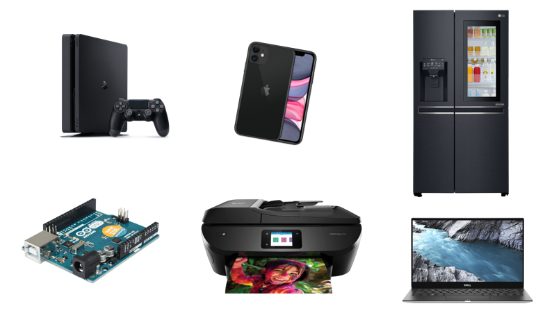

Your answers may vary. Nevertheless, the correct answer is that all of the above devices are actually computers, or include one inside of them, as they all answer to the definition that we have given: they are electronic devices which could process a pre-given sequence of commands.

**What is the meaning of a "pre-given sequence of commands"?**
<br />
In order to find that out, we have to talk about algorithms.

## An Algorithm

> An algorithm is a methodological and conclusive way to perform a specific task, in a final number of steps.

In simple words, an algorithm is a description of some actions to perform in a sequence so that each step is perfectly clear and can not be understood in two ways.

We all know all sorts of algorithms. For example, for those of you who cook - a recipe is a kind of an algorithm. You follow a series of steps to perform with the task being making food.

A recipe for a carrot cake would look something like the following:

1. Take 2 carrots and shred them
2. Mix the shredded carrots with 1 tbsp of cinnamon, and 3 tbsp of brown sugar
3. In a separate bowl mix $/frac{3}{4}$ flour cups, 1 tbsp of baking soda, 2 eggs, $/frac{1}{4}$ of a cup of sugar, and half a cup of oil
4. Mix all of the ingredients together
5. Pour them into an oiled mold
6. Insert the mold to a pre-heated oven to $180^/circ$ celsius for 40 minutes

Even though to a human the recipe looks complete, a computer can't work with these instructions, as they are too abstract. The computer is a machine - it is considered "stupid" because it knows to perform only very specific actions and it need us to tell him exactly what to do.

For instance, the first instruction: "Take 2 carrots and shred them" has to be more specific. It needs to specify exactly where to take the carrots from, how to grab them, where to place them, etc.

`youtube: https://www.youtube.com/watch?v=cDA3_5982h8`

In this video you will find a good demonstration of how important it is to be specific when giving instructions to the computer.

## Alan Turing and the Turing Machine

Alan Turing gave us another definition for a computer. According to him:

> A computer is a machine that is able to simulate any Turing machine

Alan Turing was, among other things, a mathematician and a computer scientist. He is widely considered to be the father of theoretical computer science [2]. Turing also helped the to break the German ciphers during World War *II*.

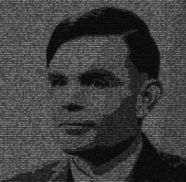

Turing invented a mathematical *model* of computation that defines an abstract machine - called a Turing machine[3]. In simple words, a Turing machine is a machine that doesn't really exist. We "imagine" it. This model helps us to define the *computational power* of modern computers.

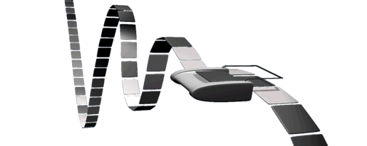

The Turing machine is made up of an infinite tape of memory cells, and a read-write head. This head is able to transition between cells on the tape, one at a time, and perform one action: read its content, or write something to it.

What Turing did was amazing - he proved, mathematically, that this simple abstract model is able to simulate any given computer algorithm that one can think of. This proof has profound implications. It means that any modern computer is computationally equivalent to this simple machine. It can compute all the things that this machine can compute, and nothing more.

To specify that a computer is computationally equivalent to a Turing machine, we say that it is "Turing complete".

# PC - The Personal Computer

So, after spending some time realizing what a computer is theoretically, let's see what a modern computer is comprised of.

Generally, almost every computer nowadays shares the same main components. These components are the parts that make even laptops, mobile phones, etc. The main difference between the components of a PC and the components of other devices are the size and their layout inside the device.

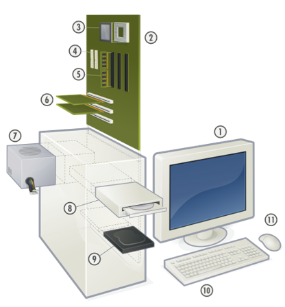

Let's review them one by one.

## Mother-Board

The motherboard is the largest component inside the computer. It is a large board that is in charge of connecting all the components together. On top of the motherboard, there are integrated electronic circuits that allows the transport of both data and electricity.

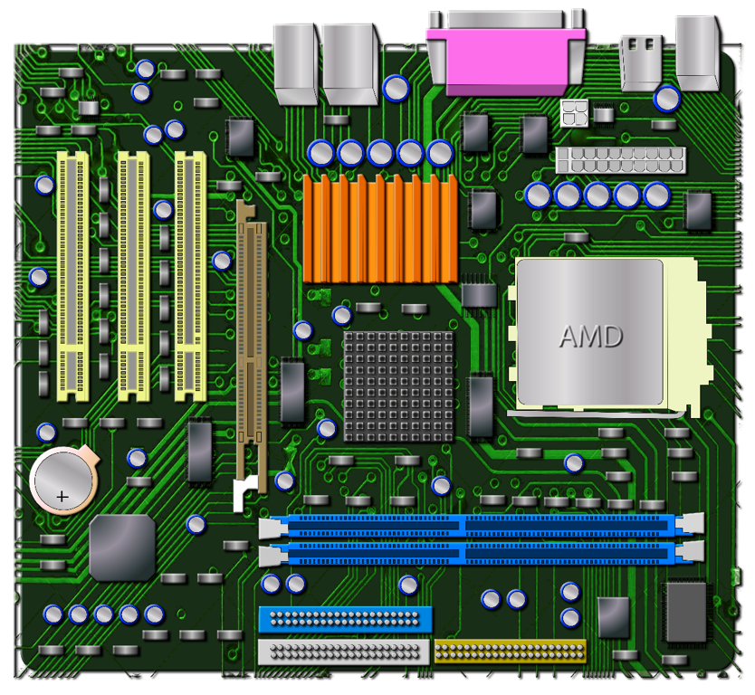

Many times the motherboard is provided with some built-in components such as the CPU, GPU, and some input/output ports.

## CPU - Central Processing Unit

The CPU is considered the brain of the computer. Each action we perform in the computer is ultimately translated to arithmetic operations such as addition, subtraction, multiplication and division. The CPU is the component that is in charge of performing these operations.

The most popular companies that produce CPUs are Intel and AMD. Their processors are measured by the amount of operations they can perform in 1 second. For example, a good processor nowadays can perform 4 billion operations per seconds, or in other words - it can perform in $4$ $GHz$ (Giga Hertz).

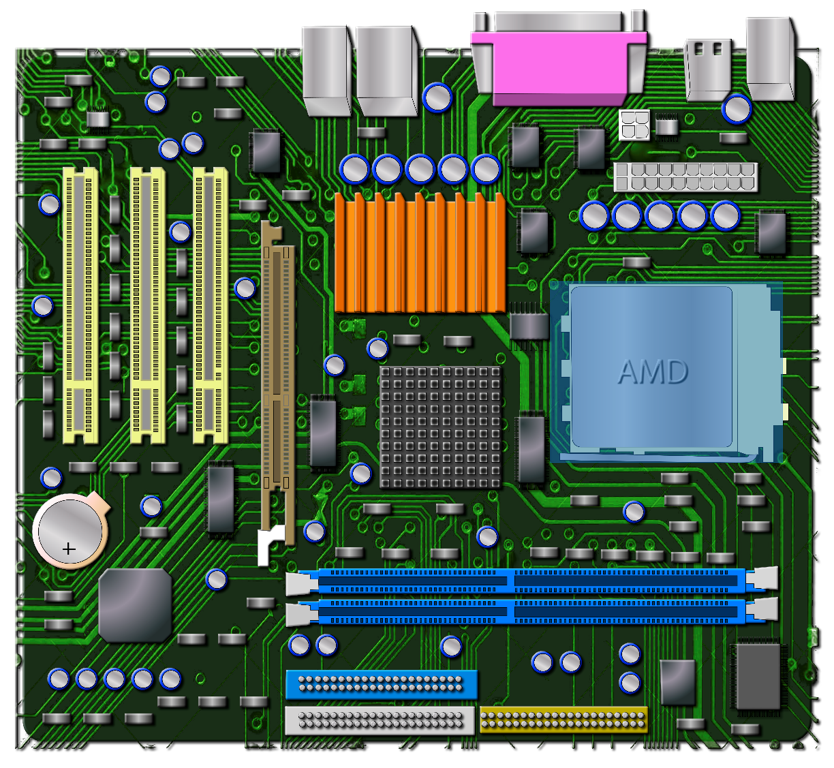

The CPU is marked in blue.

## Expansion Cards

Expansion cards are computer components that their aim is to expand the capabilities of a computer. A good example of a known expansion card is the GPU, which is the Graphic Processing Unit. It is a component that is built so that it knows to perform computations related to graphics in an efficient manner, much faster than the CPU for example. It expands the capabilities of the computer by allowing it to work faster the graphics computations.

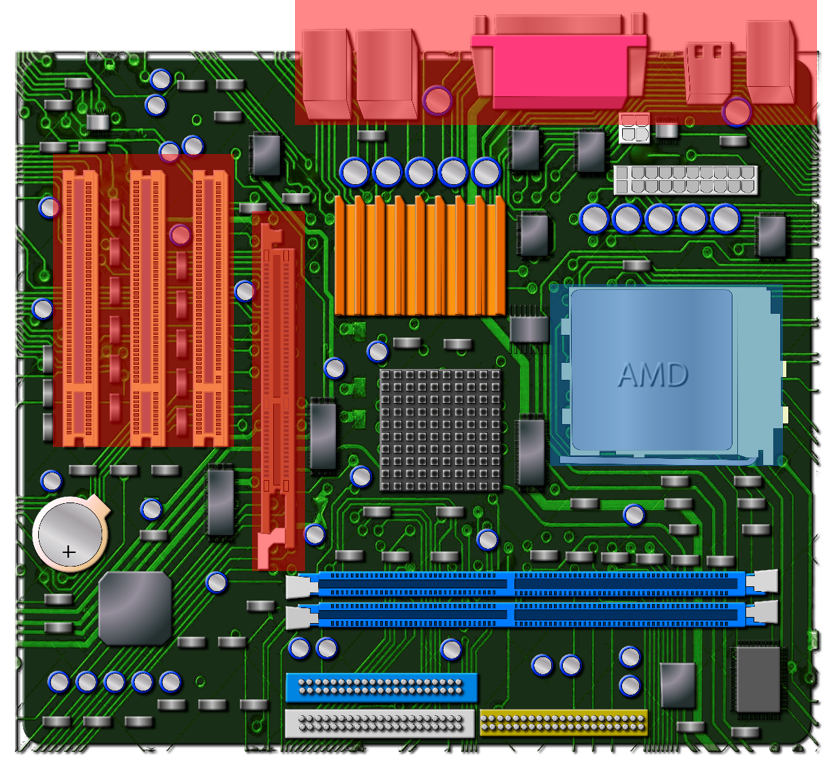

Another example of an expansion card is the NIC - the Network Interface Card. It is an expansion card which its aim is to allow internet connection, whether it is wired connection or wireless connection.

The expansion cards are located on the motherboard, and they usually have connections which needs to be exposed for the user so that he will be able to connect cables to them. All the connections are usually located on the back of the computer case.


## Volatile Memory

The computer memory is divided into 2 parts: volatile memory, and non-volatile memory.

The volatile memory is often called short-term memory, as it needs constant electrical current in order to save data. Once the current stops, even for a short term, the data is deleted. It has more synonyms such as: RAM (Random Access Memory), or internal memory.

The advantage of using such memory is that it is very fast compared to non-volatile memory. Thus, it is used mainly as a working memory. Each program on our computer stores its data in the volatile memory as long as it is open, and if we want to save our data, we have to copy the data from the volatile memory to the disk.

The RAM is measured by 2 parameters: speed and capacity. The capacity is measured by GB (Giga Bytes), and the speed is measured by MHz (Mega Hertz). A good computer today has at least 8 GB of RAM, and the speeds vary in the range between ~1500-2500 MHz.

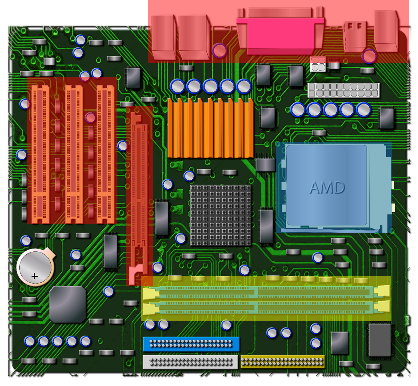

## Non-volatile Memory

The non-volatile memory is what allows the computer the store its data even though we turn it on and off. There are 2 main kinds of disks which are being used today: The Hard Disk Drive, and the Solid State Drive.

### HDD - Hard Disk Drive

The Hard Disk Drive is a disk which uses older technology in order to store the data. The technology is based on magnetic reading and writing from a metal plate. The reading and writing operations are performed using a read-write head that is static. The metal plate is constantly spinning (usually at rate of 5400/7200 Rounds Per Minute), and the read-write head is able to move along the radial axis of the plate (in simple words - in and out of the "circle").

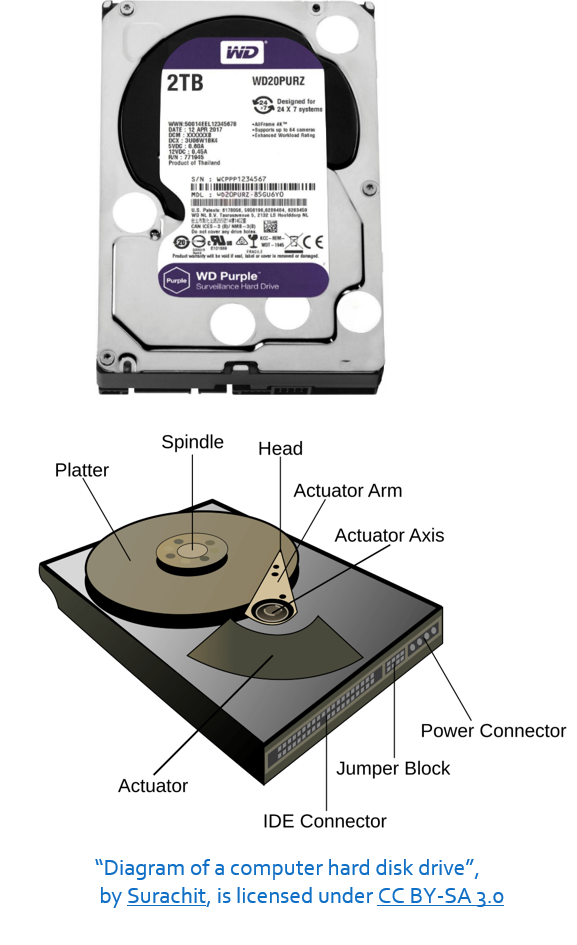

The reason that this technology is considered to be old is because the HDD counts on the speed of the metal platter, which due to physical constraints can't rotate at a high speed.

Although it is relatively slow it is very cheap, making it a good choice for storing large amounts of data. This is the main reason it is still being widely used, especially at large companies which provide cloud services such as Google, Amazon, etc.

### SSD - Solid State Drive

SSD is a disk that uses only electrical current to store its data, and has no moving parts at all. This makes it power consumption lower, and its speed greater. Moreover, they weight less and they make less noise while working.

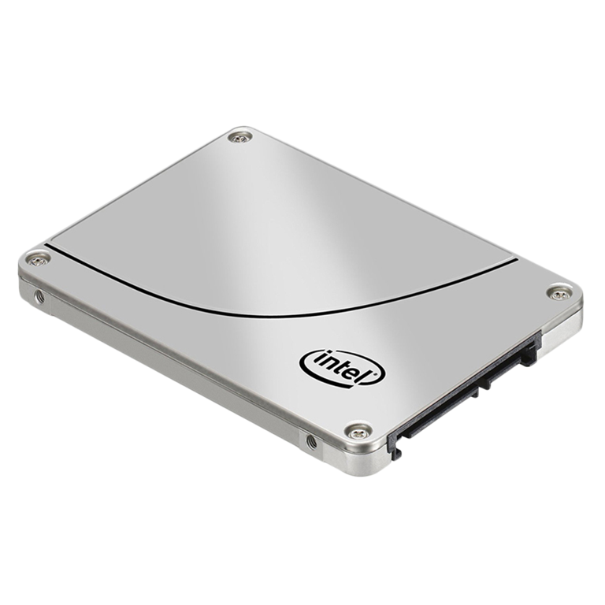

They became very popular in the first decade of the 21st century due to decrease in their price, and growth in both the use of laptops, their capacity.

Its main cons are its price, and its lifespan. However, it is still worth being used since their lifespan is not significantly shorter, at least for an end-user, and their price has become very affordable.

## Power Supply

Electronic components inside the computer are very sensitive to drastic changes in voltage. In addition, they need to be supplied with a very low voltage. Any sudden change in voltage could easily cause a malfunction and destroy them.

We all have our ways of getting electricity to our homes. Most of us are connected to an electric company via wires that spread across our entire country. In order for the current to be able to go through long distances over the cable, the electric company uses an Alternating Current, meaning that they use high voltage that periodically alternating between high positive and negative values. This current could easily destroy all the components in our computer they were wired to it directly.

This is where the power supply comes into play. Its job is to convert the AC (Alternating Current) to DC (Direct Current), making it constant and with low voltage.

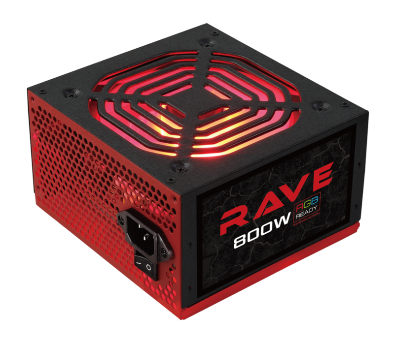

## Case

The last component we'll cover is the case. It is not much of an electronic device like the others, but it's still very important. The computer case is where all the components reside. It keeps them safe from static electricity, from dust, from moisture and from pests such as mice and snakes. In addition, it usually contains fans which are used to cool the components. The CPU could get very hot! Even over a $100^\circ$ Celsius!

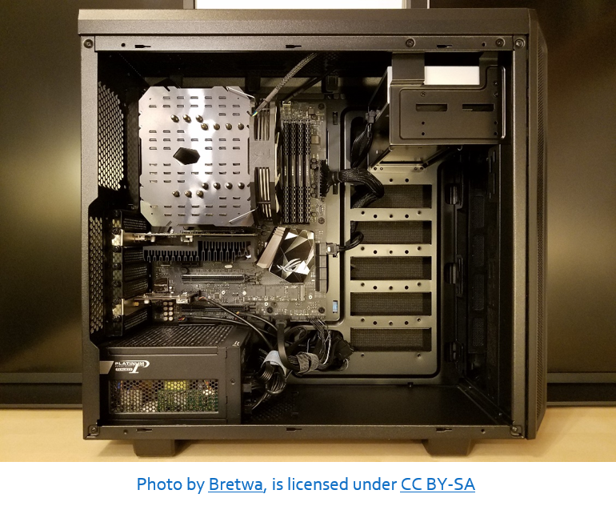

# Summary

To conclude, we have learned what a computer actually is, by definition. Afterwards, we've learned the definition of computer by Alan Turing using the Turing machine. Finally, we've taken a look inside the computer, covering every main component it contains and their role.

I hope that everything has been clear. Anyway, I'd love to get some feedback from you! Feel free to contact me via any way.

# Sources

[1] [Wikipedia: Computer Science](https://en.wikipedia.org/wiki/Computer_science)

[2] [Wikipedia: Alan Turing](https://en.wikipedia.org/wiki/Alan_Turing)

[3] [Wikipedia: Turing Machine](https://en.wikipedia.org/wiki/Turing_machine)