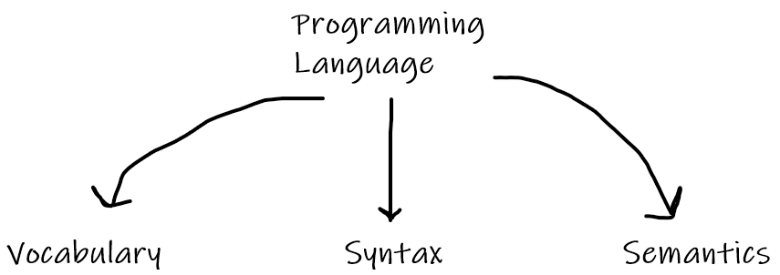
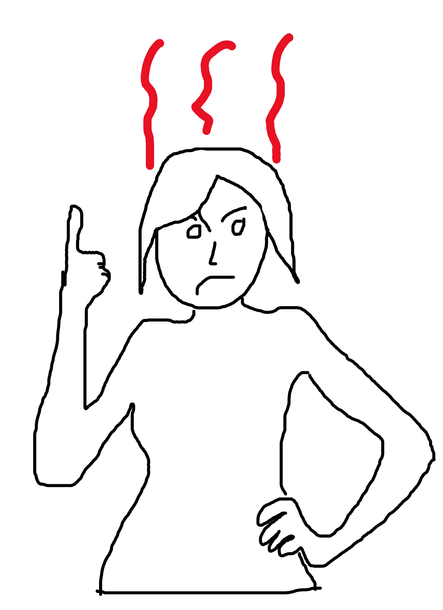

In the [previous article](/first-steps-into-computer-science) we learned what a computer is, what is an algorithm, who is Alan Turing and how he contributed to the field of computer science, and reviewed the various components a standard computer is made of.

The computer serves us, humans, in many ways. It helps us automate many processes, reducing the manpower needed to complete a certain job. Moreover, it helps us to preform tasks which are difficult, or even impossible for humans such as tasks that require great precision.

So, how do we utilize computers to our advantage? how can we communicate with it and give it instructions, or algorithms to perform?

In order to do so, we have to use a programming language.

# Table of Contents

```toc

```

# A Programming Language

> A programming language is a language through which you can instruct the computer to perform specific tasks.

## Parts of a Programming Language

Just like any other language, a programming language has 3 main parts: vocabulary, syntax, and semantics. They define the entire language.



Let's review them.

### Vocabulary

> A vocabulary of a language is the set of words which are considered to be part of the language.

A dog is a word, and so is a cat. They are both parts of the English vocabulary.
<br>
In computer science, we use a mathematical definition for a language, which is called a _formal language_.
<br />
In formal languages, there is an alphabet, which is the set of symbols that can be used to comprise a word. In English, we have the letters A-Z, and we also have other symbols like punctuation marks: '.', ',', ':', etc. Each of these is considered to be part of the alphabet of the language.
Unlike English, in programming languages we often treat a punctuation mark as a whole word. You will see examples for it later on.

### Syntax

> A syntax is a set of rules that determines what is a valid sentence in a language.

It tells us in what way we can build a valid sentence.
For instance, in English we have nouns, verbs, adjectives, etc. The English syntax (commonly known as grammar) tells us that a basic sentence has the following structure:
_Subject + Verb + Object_.

Similarly, every programming language has a syntax of its own. This syntax defines how we can build a sentence in the language so that the computer will understand us. If we try to build a sentence that contradicts the rules of the syntax, we will get a syntax error. The computer will sort of yell at us for giving him an instruction that it doesn't understand.



An interpreter or a compiler gets very mad at syntax errors. Almost as much as your mom when you don't give her back the food containers you've taken.

### Semantics

> Semantics defines the meaning of sentences in the language.

This part of a language, although tricky, is very important. When we communicate with each other, we understand the meaning of each word and of each sentence. When we look at a sentence like: "The kid is walking to school.", we understand its meaning. We are instantly thinking of an image of a small kid with its backpack on his back walking on the sidewalk with an image of a building in the background with many kids in it.

What if we look at the following sentence?
<br>
"The school is walking to kid."
<br>
This sentence doesn't make sense to us. Maybe those of you who are gifted with a great imagination can visualize a scene in which this sentence makes sense, but most of you probably immediately think to yourselves that there's probably an error in that sentence.

So just like we need semantics when we communicate with each other, we need it when we give instructions to the computer. We might be able to comprise a sentence that follows the rules of the syntax, but it also needs to have some kind of logic behind it, or else the computer will get confused, and problems will most definitely occur.

# Types of Programming Languages

There are many types of programming languages. You might have heard some of their names before: Java, C# (C Sharp), C, C++, Javascript, Assembly, etc.

Each programming language was invented for a reason. It aims to solve a certain problem, or in some cases it is related to it being a proprietary language of a software corporation (in the cases of C# and Java for instance). Some of these languages were invented long ago, some still get updated often and some don't, some are faster than others, some are more comfortable...

The point is that these languages vary. So how do you know which language you should learn? Well the truth is that it doesn't really matter (in most part). All of the languages share a great deal of common features and concepts, and once you learn them once, you can repeat the process quite easily.

Let me summarize the basic core concepts you should know to get you started with a programming language:

### Basic syntax

What are the grammar rules used in order to write a valid program in the language.

### Variable types

Every value that the computer understands needs to be stored in a specific way in the computer memory. The types usually include integers (which are whole numbers, with no decimal point), floats (numbers that include a decimal point), strings (which are sequences of characters such as "hello" - basically texts), and more which we will not cover.

Everything needs to be converted to zeroes and ones, as we'll cover in a future article. The different types helps the computer to choose the right way to do so.

### Operators

Operators are actions that can be peformed on the values that the language supports. For example - the + operator is one that usually exists in every language and it can perform the addition action on 2 numbers.

Operators ultimately allow you to manipulate the values in the program, whether they are read from a file, a disk, or the web.

### Conditions

Conditions allow our program to run dynamically, which means that it will perform certain actions according to a given state or _condition_ that is met. A simple scenario is a program that react to a user's input and perform actions accordingly.

### Loops

Loops allow us to run a code section multiple times without having to write it multiple times. Think of a program that needs to calculate the average for each student in a school that contains a thousand students. A loop in a programming language will allow us to _iterate_ over all the student and perform a single code section (that calculation of the average of the student) for each of them.

### Data structures

Data structures allow us to store a lot of data in a specific way. There are a lot of data stuctures of different types. Usually to go over the data they contain we need to use loops.

### Functions

Functions are core components of every programming language and they help us to keep our code organized.

Once you learn and master these core concepts, you will see that they repeat themselves in a very similar way in every programming language.

Let's recap with a few code snippets in different programming languages that all do the same: calculate the average of a list of numbers.

### Python

```python
numbers = [1, 4, 2, 5, 1, 9, 5, 2, 9]
sum = 0
for num in numbers:
    sum += num

print(sum / len(numbers))
```

### C

```c
#include <stdio.h>

int main() {
    int numbers[] = {1, 4, 2, 5, 1, 9, 5, 2, 9};
    int sum = 0;
    int i = 0;
    for(i = 0; i < 9; i++) {
        sum += numbers[i];
    }
    printf("%f", sum / 9.0);
    return 0;
}
```

### Javascript

```javascript
let numbers = [1, 4, 2, 5, 1, 9, 5, 2, 9]
let sum = 0
for (let i = 0; i < numbers.length; i++) {
  sum += numbers[i]
}
console.log(sum / numbers.length)
```

As you can see, most of the code snippets have lots of similarities. You're welcome to try and run these programs and play with them at [GDB Online](https://www.onlinegdb.com/).

# Summary

In future articles we'll dive deep into python - one of the most popular programming languages used today, and we'll see how everything we've talked about apply to it.
